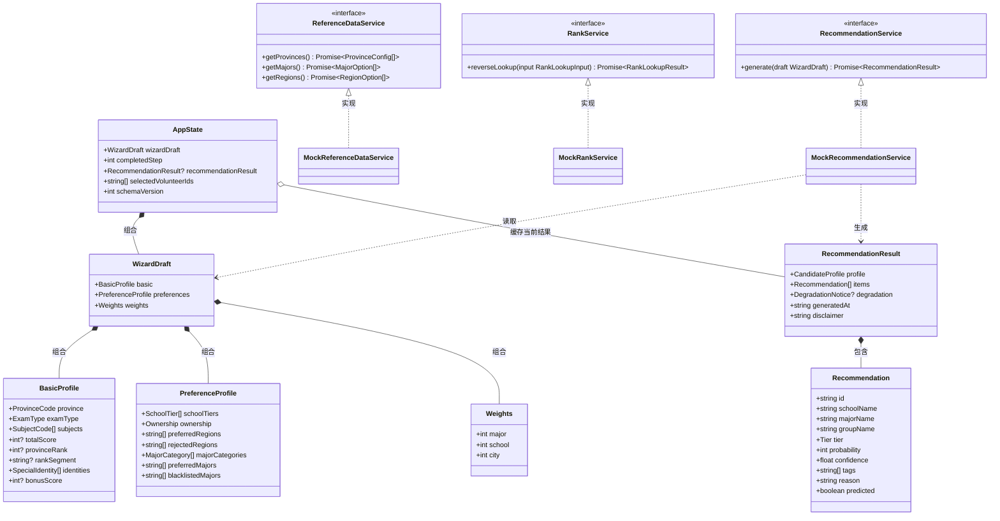
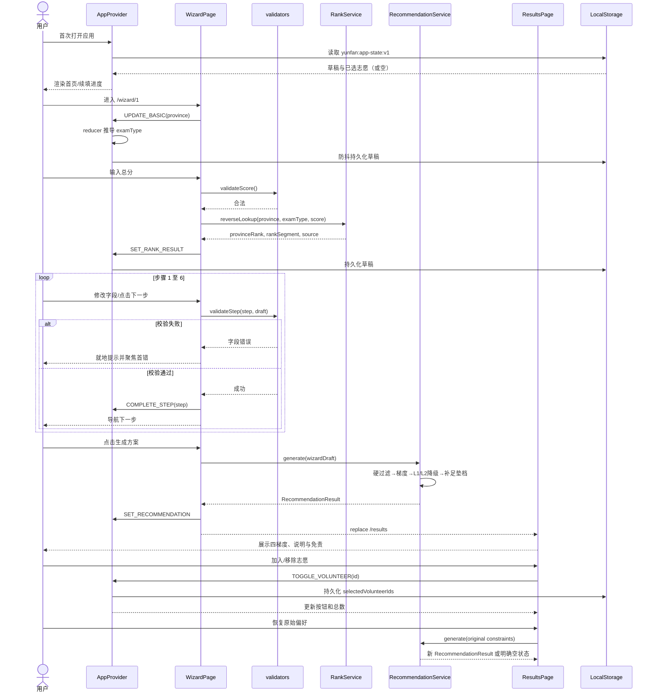
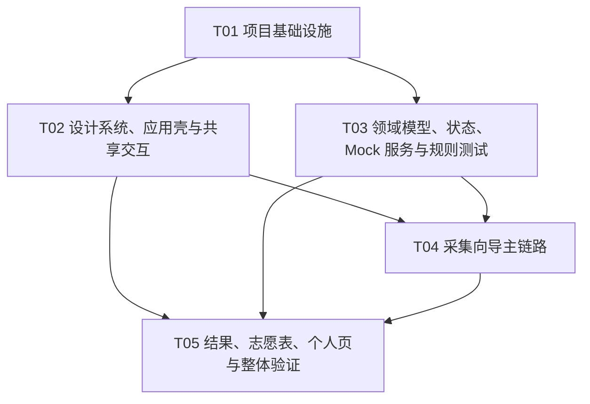

# 云帆志愿纯前端实施架构方案

| 项目 | 说明 |
|---|---|
| 文档版本 | V1.0 |
| 适用范围 | 现有 PRD 与移动端 HTML 原型的纯前端可交互实现 |
| 目标读者 | 前端工程师、测试工程师、产品与设计评审人 |
| 架构结论 | Vite + React + TypeScript，功能切片、单向数据流、本地确定性 Mock |
| 明确边界 | 本阶段不实现后端、真实招生数据、登录支付、专家服务或线上部署 |

## 0. 结论摘要

1. 使用 React 18、TypeScript 5、Vite 5；路由采用 React Router 6；样式采用 CSS Custom Properties + CSS Modules；状态采用 React Context + `useReducer`；图标采用 Lucide React；测试采用 Vitest + Testing Library。
2. 不引入 MUI、Tailwind、Zustand、Redux、React Hook Form、Zod、MSW。现有原型已有完整且高度定制的视觉语言，上述依赖会增加覆盖成本或重复能力；本项目规模用浏览器原生表单、纯函数校验和 React 内建状态即可覆盖。
3. 页面按首页、六步采集向导、推荐结果、已选志愿、个人中心组织。PRD 所称“7 步”统一解释为六步采集加结果阶段；进度条在向导内显示 1/6，完成后进入结果页。
4. 所有业务数据走 `services` 接口，当前由本地 Mock 实现；页面不得直接导入大块 Mock JSON。未来接后端时只替换服务适配器，不改页面和状态模型。
5. 用户草稿与已选志愿通过带版本号的 `localStorage` 持久化；推荐列表与提示类状态可重算，不持久化。Mock 不使用随机数，确保界面、测试与评审结果稳定。

# Part A：系统设计

## 1. 材料清单与需求证据

### 1.1 已读取材料

| 材料 | 用途 | 采用的直接证据 |
|---|---|---|
| `deliverables/product-strategy/brainstorm-gaokao-volunteer-2026-08-16.md` | 产品定位与范围背景 | 从“分数查询工具”升级为“策略顾问”；信任、反焦虑与容错是核心价值 |
| `deliverables/product-strategy/prd-volunteer-recommend-engine-2026-08-16.md` | 功能、字段、规则和验收主依据 | 省位次主键、选科拦截、六步采集加结果、冲稳保垫、降级与免责声明 |
| `deliverables/product-strategy/roadmap-prd-volunteer-2026-08-16.md` | 范围裁定与依赖依据 | P0 主链路优先；数据缺失可降级；REQ-015 的 L1/L2 是空结果兜底内核 |
| `ui-design/design-system.html` | 视觉 token 与组件规格 | “旭日东升”配色、8pt 节奏、20px 移动端边距、四梯度语义色、圆角与阴影 |
| `ui-design/prototype.html` | 页面结构和交互复刻依据 | 首页、六步向导、结果四栏、志愿选择、个人中心、Toast 与底部导航 |

### 1.2 需求证据到前端能力映射

| 需求证据 | 前端能力 | 验收锚点 |
|---|---|---|
| REQ-001/002/003 | 省份联动、模式推导、选科校验、分数反查位次 | 广东默认 `NEW_312`；非法组合不能下一步；612 分展示位次 15230 |
| REQ-004/005/006/007 | 身份条件字段、院校/地域/专业偏好与冲突提示 | 高级字段渐进展开；期望与排斥、偏好与黑名单不可冲突 |
| REQ-008/016 | 六步 Wizard、权重归一与实时预览 | 前后可逆；任一权重变化后三项精确合计 100 |
| REQ-012/015/017/020 | 四梯度结果、可解释降级、志愿表、置信度和免责 | 垫档至少 3 条；恢复原始偏好可操作；预测信息强制标注 |
| 原型首页/个人中心 | 启动、续填、快速入口、静态个人摘要 | 主 CTA 可达向导；未实现能力只提示“规划中”，不得伪装可用 |

## 2. 实现方法与技术选型

### 2.1 核心难点及处理

- **跨步骤一致性**：用单一 `AppState` 保存草稿，以 reducer 事件更新；步骤组件仅接收当前 slice 和回调，不持有第二份业务状态。
- **规则复杂但本阶段无后端**：把合法选科、权重归一、偏好冲突、位次查找、梯度分类做成无副作用纯函数；Mock 服务只负责模拟异步边界和装配数据。
- **移动原型向响应式 Web 迁移**：保留 440px 视觉基准而不保留“手机外壳”；窄屏全宽，桌面居中为单列应用壳，结果页在宽屏适度扩展卡片布局。
- **真实感与诚信边界**：使用固定、可追溯的广东演示数据；所有录取概率、外推和低置信度数据带标签和免责声明，禁止随机生成或暗示真实承诺。
- **原型与 PRD 差异**：产品语义按“六步采集 + 第七阶段结果”实现；原型中的“安心包/专家兜底”属于 Phase 2，只展示禁用或规划中状态，不构造购买流程。

### 2.2 技术栈与取舍

| 维度 | 选择 | 理由与取舍 |
|---|---|---|
| 框架 | React 18.3.1 | 组件化、生态稳定；当前无需 SSR，故不使用 Next.js |
| 语言 | TypeScript 5.5.4，开启 `strict` | 复杂枚举与跨步骤状态需要编译期约束 |
| 构建 | Vite 5.4.2 + `@vitejs/plugin-react` 4.3.1 | 纯 SPA 启动快、配置少、静态部署简单 |
| 架构 | 功能切片 + 单向数据流 + 服务适配器 | 页面、业务规则、数据源解耦；避免为小项目引入分层过度设计 |
| 样式 | CSS Modules + 全局 token CSS | 精准复刻原型且隔离组件样式；不引入 Tailwind/MUI，避免样式重置与运行时负担 |
| 路由 | React Router DOM 6.26.1 | 需要可刷新、可深链的首页/向导/结果/志愿表/个人页 |
| 状态 | React Context + `useReducer` | 全局状态规模有限；不引入 Redux/Zustand，减少依赖和双重范式 |
| 持久化 | 原生 `localStorage`，schema version `1` | 保存草稿与志愿选择；解析失败时安全回退默认值 |
| 图标 | Lucide React 0.468.0 | SVG、可访问、风格一致；业务 emoji 仅保留原型品牌点缀，不作为唯一状态提示 |
| 表单 | 原生受控输入 + 纯函数验证 | 六步表单不复杂到需要 React Hook Form/Zod；共享校验规则独立可测 |
| 测试 | Vitest 2.1.8 + Testing Library | 与 Vite 同构；重点验证规则、状态、关键用户流，不做脆弱像素快照 |
| 质量 | ESLint 9.9.1 + typescript-eslint 8.3.0 | 静态检查未使用变量、Hook 与可访问性常见问题 |

### 2.3 运行架构

```text
BrowserRouter
  └─ AppProvider（草稿、推荐结果、已选志愿、通知）
      └─ AppShell（最大宽度、背景、底部导航、安全区）
          └─ Route pages
              ├─ feature components
              ├─ shared UI components
              ├─ domain pure functions
              └─ service interfaces → mock adapters → typed fixture data
```

## 3. 页面、组件、状态与交互清单

### 3.1 页面与路由

| 路由 | 页面 | 核心内容 | 关键交互 |
|---|---|---|---|
| `/` | `HomePage` | Hero、主 CTA、进度、快速通道、信任说明 | 开始/继续填报；快速跳到相应步骤；去结果/志愿表 |
| `/wizard/:step` | `WizardPage` | 六步采集、进度、固定底部操作 | 上一步/下一步；即时校验；刷新后恢复；完成后生成推荐 |
| `/results` | `ResultsPage` | 用户摘要、降级横幅、四梯度标签、推荐卡、免责 | 切换梯度；加入/移除志愿；恢复原始偏好；空状态回向导 |
| `/volunteers` | `VolunteerListPage` | 已选条目、梯度分组、数量摘要 | 删除；清空需二次确认；返回结果补充 |
| `/profile` | `ProfilePage` | 用户摘要、方案/保底/收藏指标、常用入口 | 重新填报；进入志愿表；未实现入口显示 Toast |
| `*` | `NotFoundPage` | 轻量错误说明 | 返回首页 |

### 3.2 组件边界

- **应用壳**：`AppShell`、`BottomNav`、`RouteErrorBoundary`、`ToastRegion`。
- **通用 UI**：`Button`、`Card`、`Chip`、`Badge`、`Banner`、`ProgressBar`、`FormField`、`EmptyState`、`ConfirmDialog`。
- **向导**：`WizardHeader`、`WizardFooter`、`ProvinceStep`、`ScoreStep`、`SubjectsStep`、`IdentityStep`、`PreferenceStep`、`WeightStep`、`SubjectPicker`、`WeightSliders`。
- **结果**：`TierTabs`、`RecommendationCard`、`DegradationBanner`、`DisclaimerCard`、`VolunteerSummaryBar`。
- 组件规则：页面负责装配与导航，feature 组件负责业务交互，shared 组件不认识“院校/位次”等领域概念。

### 3.3 状态清单

| 状态 | 归属 | 是否持久化 | 说明 |
|---|---|---|---|
| `wizardDraft` | App reducer | 是 | 六步输入唯一真源 |
| `completedStep` | App reducer | 是 | 允许继续填报和防止越级访问 |
| `recommendationResult` | App reducer | 否 | 可由草稿重新生成，避免缓存陈旧结果 |
| `selectedVolunteerIds` | App reducer | 是 | 集合语义；序列化为数组 |
| `activeTier` | Results 页面 | 否 | 纯展示状态 |
| `loading/error` | 各 service 调用 | 否 | 显式展示骨架、错误与重试 |
| `toast/dialog` | App UI context/局部 | 否 | Toast 使用 `aria-live`；确认框管理焦点 |

### 3.4 关键交互规则

1. 每步“下一步”先同步校验；无效时阻止导航、展示就地错误，并聚焦首个错误控件。
2. 分数输入防抖 300ms 后调用 `rankService.reverseLookup`；新请求发起时忽略旧响应，避免竞态覆盖。
3. `NEW_312` 强制物理/历史二选一，加化/生/政/地四选二；`NEW_33` 六选三；老高考展示固定组合。
4. 权重滑块移动一个时，另两个按原比例分配余量；用“最大余数法”收尾，保证整数和恒为 100；键盘箭头操作同样触发。
5. 生成方案期间主按钮进入忙碌状态并禁止重复提交；成功后 `replace('/results')`，失败保留草稿并可重试。
6. 推荐卡加入操作须幂等；按钮文字、计数和志愿页同时更新。不得仅靠颜色表示已加入。
7. 结果页若无完整草稿或结果，展示明确空状态并引导回最近未完成步骤，而不是呈现伪数据。

## 4. 数据结构与接口



### 4.1 服务契约与错误约定

```ts
interface ServiceError {
  code: 'INVALID_INPUT' | 'NOT_FOUND' | 'TEMPORARY_FAILURE';
  message: string;
  field?: string;
}
```

- UI 只依赖服务接口，不依赖 Mock 文件路径。
- Mock Promise 延迟固定在 250–450ms，不随机失败；测试环境用零延迟注入。
- 所有时间使用 ISO 8601 字符串；ID 为稳定可读字符串（如 `gd-sysu-cs-a`）。
- `confidence` 是 0–1 数值，展示层负责转成“高/中/低”与百分比；预测项必须 `predicted=true`。
- `RecommendationResult.items` 是标准化扁平数组，梯度标签由 `tier` 派生，避免存四份重复列表。

## 5. 本地模拟数据方案

1. **引用数据**：`provinces.ts` 保存首发演示省及考试模式；`majors.ts` 保存专业门类和选科要求；`regions.ts` 保存经济圈映射。虽然 PRD 要求未来由后端配置提供，本地文件只是接口后的临时实现。
2. **位次表**：仅放足以支持演示输入范围的广东 2026 段位 fixture；使用排序数组与二分查找。超出范围返回 `NOT_FOUND` 并允许用户手填，必须标注“手动”。
3. **候选数据**：固定学校/专业组集合，包含各梯度、低置信度新增专业、选科不匹配和黑名单样本，便于覆盖所有状态。
4. **推荐计算**：前端演示算法依次执行硬过滤、偏好过滤、梯度分类和 L1/L2 降级；它用于表现交互，不声明为生产推荐算法。垫档不足时由 fixture 中明确的兜底候选补足到 3。
5. **可重复性**：禁止 `Math.random()`；所有概率、位次和生成结果由输入与 fixture 决定。测试可直接断言具体结果。
6. **持久化**：key 为 `yunfan:app-state:v1`；只存 draft、completedStep、selected IDs。hydrate 时校验最小结构，版本不符则迁移或丢弃，不让损坏 JSON 阻塞启动。

## 6. 程序调用流



## 7. 文件目录与职责

> 下列为工程师应创建的完整源码结构；测试与实现同任务交付。配置集中在根目录，不触碰 `.workbuddy-ai/`。

```text
.
├── package.json                         # 精确依赖、脚本、Node/pnpm engines
├── pnpm-lock.yaml                       # 锁定传递依赖
├── index.html                           # SPA HTML 入口、viewport 与中文 lang
├── vite.config.ts                       # Vite、React、Vitest 与别名
├── tsconfig.json                        # TS 项目引用入口
├── tsconfig.app.json                    # 浏览器源码严格配置
├── tsconfig.node.json                   # 构建配置类型
├── eslint.config.js                     # ESLint flat config
├── src/
│   ├── main.tsx                         # React 根节点与 BrowserRouter
│   ├── app/
│   │   ├── App.tsx                      # 路由表与顶层 Provider
│   │   ├── AppShell.tsx                 # 响应式应用壳、主内容与底栏槽位
│   │   ├── AppShell.module.css          # 壳层、背景、安全区与断点
│   │   ├── routes.ts                    # 路由常量、向导路径助手
│   │   └── RouteErrorBoundary.tsx       # 页面级异常恢复
│   ├── styles/
│   │   ├── tokens.css                   # 颜色、渐变、字体、间距、圆角、阴影、层级
│   │   ├── reset.css                    # 最小化浏览器归一化
│   │   └── global.css                   # body、焦点、减少动画、辅助类
│   ├── types/
│   │   ├── domain.ts                    # WizardDraft、Recommendation 等领域类型
│   │   └── services.ts                  # 服务接口、输入输出与 ServiceError
│   ├── state/
│   │   ├── AppContext.tsx               # Context、provider、selectors
│   │   ├── appReducer.ts                # 事件与不可变状态转换
│   │   ├── initialState.ts              # 默认值与 schema version
│   │   ├── persistence.ts               # localStorage hydrate/save/migrate
│   │   └── appReducer.test.ts            # 跨步、权重、志愿幂等测试
│   ├── data/
│   │   ├── provinces.ts                 # 省份、模式、满分、规则摘要 fixture
│   │   ├── majors.ts                    # 专业目录及选科要求 fixture
│   │   ├── regions.ts                   # 省市与经济圈 fixture
│   │   ├── rankSegments.ts              # 一分一段演示数据
│   │   └── candidates.ts                # 推荐候选与特殊状态 fixture
│   ├── services/
│   │   ├── index.ts                     # 默认服务实例及未来适配器切换点
│   │   ├── mockReferenceDataService.ts   # 引用数据异步查询
│   │   ├── mockRankService.ts            # 分数到位次反查
│   │   └── mockRecommendationService.ts  # 纯前端确定性推荐装配
│   ├── domain/
│   │   ├── validation.ts                # 分步字段与冲突校验纯函数
│   │   ├── subjects.ts                  # 各考试模式合法选科规则
│   │   ├── weights.ts                   # 三权重整数归一算法
│   │   ├── recommendation.ts            # 过滤、梯度、L1/L2 降级纯函数
│   │   ├── rank.ts                      # 二分查找与区间格式化
│   │   ├── validation.test.ts            # 必填/冲突/边界测试
│   │   └── recommendation.test.ts        # 四梯度、垫档、降级测试
│   ├── components/
│   │   ├── ui/                          # Button/Card/Chip/Badge/Banner/ProgressBar/
│   │   │                                # FormField/EmptyState/ConfirmDialog 及各 CSS Module
│   │   ├── navigation/BottomNav.tsx     # 四项底部导航
│   │   ├── navigation/BottomNav.module.css
│   │   ├── feedback/ToastRegion.tsx     # aria-live 通知区域
│   │   └── feedback/ToastRegion.module.css
│   ├── features/
│   │   ├── wizard/
│   │   │   ├── WizardHeader.tsx         # 标题、1/6 进度与步骤名
│   │   │   ├── WizardFooter.tsx         # 固定前后按钮与 loading
│   │   │   ├── ProvinceStep.tsx         # 省份/模式联动
│   │   │   ├── ScoreStep.tsx            # 分数、位次反查与覆盖提示
│   │   │   ├── SubjectsStep.tsx         # 动态选科与非法组合拦截
│   │   │   ├── IdentityStep.tsx         # 身份与条件字段渐进披露
│   │   │   ├── PreferenceStep.tsx       # 院校/地域/专业/黑名单
│   │   │   ├── WeightStep.tsx           # 权重预设、滑块、分布预览
│   │   │   ├── SubjectPicker.tsx        # 可访问选择组
│   │   │   ├── WeightSliders.tsx        # 键盘可控三滑块
│   │   │   └── wizard.module.css        # 向导共享布局
│   │   └── results/
│   │       ├── TierTabs.tsx              # 冲稳保垫 tabs/tabpanel
│   │       ├── RecommendationCard.tsx    # 院校、概率、标签、原因、加入按钮
│   │       ├── DegradationBanner.tsx     # 放宽说明与恢复入口
│   │       ├── DisclaimerCard.tsx        # 预测非承诺
│   │       ├── VolunteerSummaryBar.tsx   # 固定已选摘要
│   │       └── results.module.css        # 结果功能样式
│   └── pages/
│       ├── HomePage.tsx / HomePage.module.css
│       ├── WizardPage.tsx / WizardPage.module.css
│       ├── ResultsPage.tsx / ResultsPage.module.css
│       ├── VolunteerListPage.tsx / VolunteerListPage.module.css
│       ├── ProfilePage.tsx / ProfilePage.module.css
│       ├── NotFoundPage.tsx
│       └── AppFlow.test.tsx              # 首页→向导→结果→志愿表主流程
└── deliverables/
    └── frontend-architecture.md          # 本实施蓝图
```

## 8. 视觉 token 与原型复刻规则

### 8.1 必须落成 CSS 变量的 token

| 类别 | Token | 值/规则 |
|---|---|---|
| 主色 | `--color-sun-coral/orange/amber` | `#FF6B5C / #FF9F43 / #FFC93C` |
| 辅色 | `--color-sky/sky-deep/sprout/bloom` | `#4DA3FF / #2E86DE / #2ED47A / #1AB6C4` |
| 中性色 | `--color-ink/ink-soft/ink-faint/paper/card/line` | `#1F2A44 / #5B6B85 / #9AA7BD / #FFF8F0 / #FFF / #EEF1F6` |
| 主渐变 | `--gradient-sun` | `135deg, #FFC93C 0%, #FF9F43 36%, #FF6B5C 70%, #4DA3FF 100%` |
| 梯度语义 | `--tier-reach/match/safe/cushion` | 红 / 蓝 / 绿 / 青；必须同时有文本标签 |
| 字体 | `--font-sans` | PingFang SC、Hiragino Sans GB、Microsoft YaHei、system-ui |
| 数字 | `--font-numeric` | `ui-monospace, SFMono-Regular, Menlo, monospace` |
| 间距 | `--space-1..12` | 4/8/12/16/20/24/32/40/48px 等 4px 子阶、8px 主节奏 |
| 圆角 | `--radius-sm/md/lg/full` | 12/14/20/999px |
| 阴影 | `--shadow-sm/md` | 原型暖色低透明阴影，不使用深黑重阴影 |

### 8.2 复刻约束

- 以原型 **440px 内容宽度**为视觉校准点；实现中移除设备黑框、刘海与伪状态栏，它们只属于展示稿，不属于产品 UI。
- `<360px` 保持 16px 横向边距；`360–767px` 使用 20px；`>=768px` 应用壳最大宽 560px，结果列表最大宽 760px，可用两列卡片但阅读顺序不变。
- 底部导航与向导/结果操作栏使用 `position: sticky` 或布局固定区，并叠加 `env(safe-area-inset-bottom)`；不得遮挡最后一张卡片。
- 主 CTA 使用旭日橙红渐变；正文不能放在复杂全谱渐变上，确保对比度。概率数字使用数字字体和 `font-variant-numeric: tabular-nums`。
- 交互动效控制在 160–350ms，限于 opacity/transform/颜色；尊重 `prefers-reduced-motion: reduce`，关闭非必要动画。
- 不复刻原型内联样式和 JS 拼接 HTML；必须转为语义 JSX、CSS Module 与数据驱动渲染。
- 原型 emoji 可作为装饰，但要 `aria-hidden="true"`；导航与按钮采用 Lucide 图标并带可见文字或 `aria-label`。

## 9. 响应式与可访问性策略

### 9.1 响应式

- Mobile-first；不使用固定高度 `956px`，使用 `min-height: 100dvh` 并为旧浏览器提供 `100vh` 回退。
- 输入框、按钮和选择项最小触控区域 44×44px；在 320px 宽度不产生横向滚动。
- 四梯度 tabs 在窄屏保持四等分，文案采用短标签，数量另行显示；推荐卡信息允许自然换行。
- 桌面不扩成后台式多栏应用，保持决策流程的聚焦单列；仅结果卡可在充足宽度下两列。
- 内容区为底部固定栏预留 padding；软键盘弹出时主要表单仍可滚动到焦点位置。

### 9.2 可访问性

- 页面使用 `header/main/nav/footer`；每页唯一 `h1`，标题层级连续；路由切换后将焦点移到主标题。
- BottomNav 使用链接而非可点击 `div`，当前项设置 `aria-current="page"`。
- Chips 实现为 checkbox/radio 语义；选科组用 `fieldset/legend`；错误通过 `aria-invalid` 与 `aria-describedby` 关联。
- Tier tabs 遵循 `role=tablist/tab/tabpanel`，支持左右方向键、Home/End；滑块使用原生 range，显示当前值和可读名称。
- Toast 使用 `role=status aria-live=polite`；阻塞错误用 `role=alert`；Dialog 捕获焦点、支持 Escape、关闭后归还触发器。
- 正常文本与背景对比度至少 4.5:1，大字至少 3:1；浅橙/浅蓝仅作背景，不能直接承载低对比文本。
- 所有状态都使用“图标 + 文本 +（可选）颜色”，例如“冲 Reach”“已加入”，不靠颜色单独传达。
- 自动位次查询显示屏幕阅读器可感知的忙碌/完成状态；动态结果容器设置恰当的 `aria-busy`。

# Part B：任务分解

## 10. 必需依赖包精确清单

> 新建项目时使用下列精确版本（不写 `^`/`~`），由 `pnpm-lock.yaml` 锁定传递依赖；Node `20.15.1`、pnpm `9.12.3`。

### 10.1 运行时依赖

```text
- react@18.3.1：UI 框架
- react-dom@18.3.1：浏览器渲染
- react-router-dom@6.26.1：SPA 路由与深链
- lucide-react@0.468.0：一致的 SVG 图标
```

### 10.2 开发依赖

```text
- typescript@5.5.4：严格类型检查
- vite@5.4.2：开发服务器与生产构建
- @vitejs/plugin-react@4.3.1：React Fast Refresh 与 JSX 转换
- @types/react@18.3.3：React 类型
- @types/react-dom@18.3.0：React DOM 类型
- eslint@9.9.1：静态检查
- @eslint/js@9.9.1：ESLint JavaScript 推荐规则
- typescript-eslint@8.3.0：TypeScript ESLint 解析与规则
- eslint-plugin-react-hooks@5.1.0：Hooks 规则
- eslint-plugin-react-refresh@0.4.11：Fast Refresh 导出约束
- vitest@2.1.8：单元/组件测试运行器
- jsdom@25.0.1：浏览器 DOM 测试环境
- @testing-library/react@16.1.0：组件行为测试
- @testing-library/user-event@14.5.2：真实用户输入模拟
- @testing-library/jest-dom@6.6.3：DOM 可读断言
```

明确不安装：MUI、Tailwind、Redux Toolkit、Zustand、Axios、React Hook Form、Zod、MSW、任何图表库。预览柱形分布用语义 HTML/CSS 即可；Mock 服务是本地函数，不需要网络拦截层。

## 11. 有序任务列表（最多 5 个，按依赖）

### T01：项目基础设施
- **Source Files**：`package.json`、`pnpm-lock.yaml`、`index.html`、`vite.config.ts`、`tsconfig*.json`、`eslint.config.js`、`src/main.tsx`、`src/app/App.tsx`、`src/app/routes.ts`、`src/styles/reset.css`、`src/styles/global.css`
- **Dependencies**：无
- **Priority**：P0
- **交付**：可启动、可构建、可 lint/test 的严格 TypeScript SPA；路由骨架可刷新；脚本固定为 `dev/build/typecheck/lint/test/test:run`。

### T02：设计系统、应用壳与共享交互
- **Source Files**：`src/styles/tokens.css`、`src/app/AppShell.tsx`、`src/app/AppShell.module.css`、`src/app/RouteErrorBoundary.tsx`、`src/components/ui/*`、`src/components/navigation/*`、`src/components/feedback/*`、`src/pages/HomePage.*`、`src/pages/NotFoundPage.tsx`
- **Dependencies**：T01
- **Priority**：P0
- **交付**：响应式应用壳、底部导航、共享组件、首页和错误恢复；复刻 token，移除设备外框；键盘焦点和 reduced-motion 完成。

### T03：领域模型、状态、Mock 服务与规则测试
- **Source Files**：`src/types/*`、`src/state/*`、`src/data/*`、`src/services/*`、`src/domain/*`
- **Dependencies**：T01
- **Priority**：P0
- **交付**：严格领域类型、版本化持久化、确定性 fixture/服务、选科/位次/权重/推荐/降级纯函数及测试；服务接口与实现解耦。

### T04：采集向导主链路
- **Source Files**：`src/pages/WizardPage.*`、`src/features/wizard/*`、`src/pages/HomePage.tsx`、`src/state/AppContext.tsx`、`src/services/index.ts`
- **Dependencies**：T02、T03
- **Priority**：P0
- **交付**：六步采集全部可用；前后跳转与刷新恢复；位次反查 loading/error；非法选科/偏好冲突拦截；权重恒为 100；提交防重复并进入结果。

### T05：结果、志愿表、个人页与整体验证
- **Source Files**：`src/pages/ResultsPage.*`、`src/pages/VolunteerListPage.*`、`src/pages/ProfilePage.*`、`src/features/results/*`、`src/pages/AppFlow.test.tsx`、`src/app/App.tsx`
- **Dependencies**：T02、T03、T04
- **Priority**：P0
- **交付**：四梯度 tabs、解释/置信度/预测标注、L1/L2 横幅、恢复偏好、志愿增删持久化、个人入口和未实现提示；完成 typecheck、lint、test、build 与 320/440/768/1280px 手工冒烟。

## 12. 任务依赖图



## 13. Shared Knowledge（跨切面实施约定）

- 枚举值在状态和服务层使用英文稳定码，中文只在展示映射中出现；不得把展示文案当业务判断条件。
- 所有日期为 ISO 8601；概率为整数 0–100，置信度为 0–1；省位次越小代表越优。
- 当前是纯前端演示实现，服务调用仍保持 Promise 接口；页面不得直接 `setTimeout` 或读取 fixture。
- reducer 是全局业务状态唯一写入口；不直接修改对象/数组，不在组件中维护草稿副本。
- `localStorage` 仅存必要字段且带版本号；禁止持久化 loading、错误、Toast、完整推荐响应。
- 所有预测/外推数据必须显示“预测数据”与置信度；页面底部固定出现“预测非承诺”免责声明。
- “垫档至少 3 个”是演示算法硬性不变量；若数据不足，显示明确不足/降级说明，不得复制相同候选凑数。
- 禁止在 UI 中宣称“绝对录取”“绝不滑档”。原型营销文案“100% 保底”改为“方案含至少 3 个垫档候选”，避免概率承诺。
- CSS 禁止散落同义色值；新增视觉值优先引用 token。CSS class 只做表现，不承载业务含义。
- 测试优先查询角色/标签/可见文案，不使用实现类名；核心规则必须是纯函数单测，主流程至少一条集成测试。
- 所有可点击元素使用语义 `button/a/input`；禁止给普通 `div` 绑定点击作为唯一交互。
- 不删除、不修改 `.workbuddy-ai/`；不在本任务创建后端、接口服务器、数据库或部署配置。

## 14. 待确认项与可执行默认假设

| 待确认项 | 风险/影响 | 本次可执行默认假设 |
|---|---|---|
| 首发省份范围 | 影响配置与演示数据量 | UI 保留省份选择；完整交互和数据仅保证广东，其他省显示“演示数据建设中”而不伪造结果 |
| “7 步”与原型 6 步不一致 | 影响进度文案 | 六步为输入，第七阶段是结果；向导显示 1/6，首页写“6 步采集，约 5 分钟生成方案” |
| 具体概率能否对外展示 | 存在承诺误读 | 按原型展示但始终标“估算”，并紧邻置信度与免责声明；不得使用“录取保证” |
| L5 专家兜底 | PRD 明确 Phase 2 | 仅提供“调整偏好/返回搜索”引导；专家入口显示“规划中”，不可购买 |
| 安心包 ¥199 | 与 MVP Non-goal 冲突 | 不显示价格和购买 CTA；个人页可显示禁用的 Phase 2 能力说明 |
| 权重初始值 | PRD 尚待用户研究 | 默认 50/30/20 以匹配原型，同时提供 33/33/34 均衡与三个预设 |
| 首页 1300 万“年服务考生” | 市场规模被误作产品业绩 | 改为“全国年高考报名 1300万+（行业背景）”或删除，不宣称本产品已服务 |
| 志愿排序/拖拽 | PRD 只要求组装，未明确排序 | 首版按加入顺序展示，可删除；不引入 DnD 依赖，确认需要后再做原生按钮上移/下移 |
| 真实 API 错误格式 | 尚无后端契约 | 统一前端 `ServiceError`；未来通过 adapter 映射，不让页面依赖网络响应结构 |
| 浏览器支持范围 | 影响 CSS 与构建 target | 默认最近两个版本 Chrome/Edge/Safari 和 iOS Safari 16+；不支持 IE |
| 数据与免责声明法律文案 | 属法务决策 | 暂用 PRD 文案“基于历史位次与招生计划估算，仅供参考，最终以省考试院为准”，上线前必须法务审定 |

## 15. 工程验收与自检清单

### 15.1 自动验证

```bash
pnpm typecheck
pnpm lint
pnpm test:run
pnpm build
```

### 15.2 必测业务场景

1. 首次打开无草稿；从首页开始，刷新后仍能续填。
2. 广东推导为 3+1+2；物理与历史不能同时选；再选科必须恰好两门。
3. 分数超满分、位次偏差、身份加分上限、地域互斥、专业偏好与黑名单冲突均有可访问错误提示。
4. 三滑块分别拖到 0、50、100 及键盘调整后，三项整数之和始终为 100。
5. 生成结果包含冲/稳/保/垫，垫档不少于 3；预测候选有置信度与预测标签；免责文案始终可见。
6. 触发严格偏好空结果时出现 L1/L2 说明；恢复原始偏好不静默修改输入。
7. 加入、取消、刷新、进入志愿页后的数量和按钮状态一致；清空操作需要确认。
8. 无结果直达 `/results`、非法 `/wizard/99`、未知路由均有安全恢复路径。
9. 320px、440px、768px、1280px 无横向滚动与底栏遮挡；200% 文本缩放仍可完成主流程。
10. 全键盘完成主流程；焦点可见；屏幕阅读器可读步骤、错误、tabs、Toast；减少动画设置生效。

### 15.3 本架构文档自检结果

- 已完整覆盖 3 份 Markdown 和 2 份 HTML 输入材料。
- 已给出页面、组件、状态、交互、技术选型、精确依赖、文件职责、模型、Mock、响应式、可访问性、任务与默认假设。
- 任务共 5 个，T01 为项目基础设施；每项均覆盖至少 3 个相关文件；T02/T03 可并行，依赖链不过度线性。
- 未将 Phase 2/3 能力混入 MVP；未要求后端；未触碰 `.workbuddy-ai/`。
