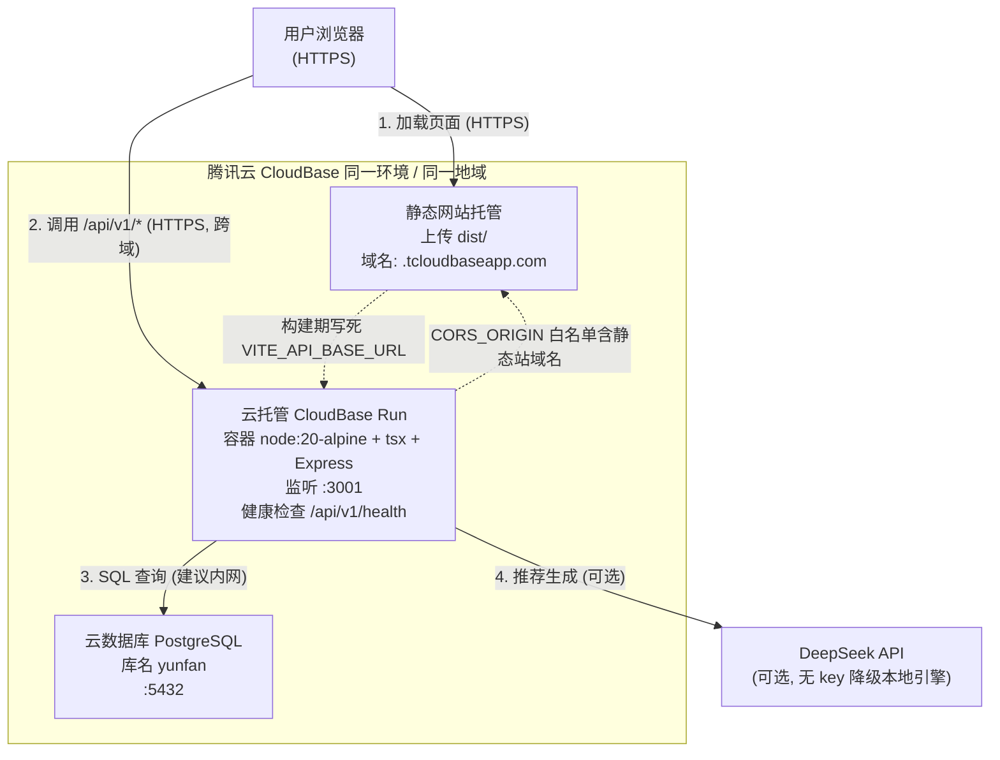
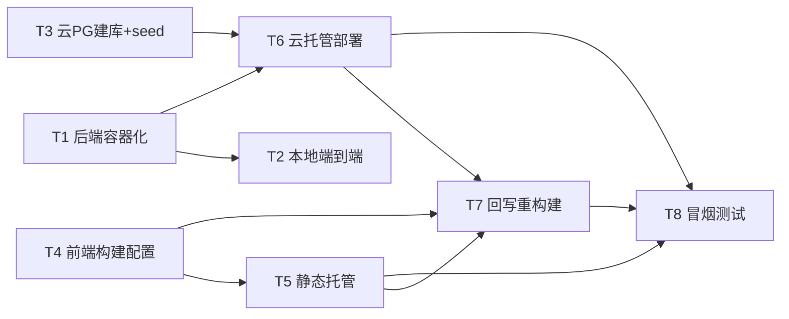

# 云帆志愿（yunfan-volunteer）CloudBase 部署架构方案

> 文档角色：架构设计（Architecture Design）
> 作者：高见远（software-architect）
> 适用范围：将「云帆志愿」全栈 Web 应用部署到**腾讯云 CloudBase**（静态网站托管 + 云托管 CloudBase Run + 云数据库 PostgreSQL）
> 说明：本文档只做设计与部署规划，**不包含应用业务代码实现**；所有新增文件均为部署/基础设施配置。

---

## 0. 架构一句话

前端 `dist/` 托管在 **CloudBase 静态网站托管**，浏览器从静态站加载页面后通过 `VITE_API_BASE_URL` 跨域调用 **CloudBase 云托管（CloudBase Run）** 中的后端容器（Node20 + tsx + Express，监听 3001），后端以 `DATA_SOURCE=postgres` 连接 **腾讯云数据库 PostgreSQL**，并在 `USE_LLM` 且有 `DEEPSEEK_API_KEY` 时调用 DeepSeek（无 key 自动降级本地引擎）。

---

## 1. 整体架构说明

| 层 | 腾讯云产品 | 关键配置 |
|----|-----------|---------|
| 用户接入 | 浏览器（HTTPS） | 访问静态站域名，渲染 React 单页应用 |
| 前端 | **CloudBase 静态网站托管** | 上传 `dist/`，`base:'./'`，默认域名 `https://<envId>.tcloudbaseapp.com`（可绑定自定义域名 + HTTPS） |
| 后端 | **CloudBase 云托管（CloudBase Run）** | 容器服务，镜像由 `server/Dockerfile` 构建；监听 `0.0.0.0:3001`；健康检查 `GET /api/v1/health`；公网可访问 |
| 数据库 | **腾讯云数据库 PostgreSQL** | 实例与云托管同地域/VPC；库名 `yunfan`；业务表 `schema.sql` + 认证表 `auth-schema.sql` + 种子 `db:seed` |
| 可选外部 | DeepSeek（OpenAI 兼容） | 环境变量注入 `DEEPSEEK_API_KEY`；缺失则降级 |

**数据流**：
- 浏览器 →（HTTPS）静态托管拉取前端资源。
- 浏览器 →（HTTPS，跨域 `/api/v1/*`）云托管后端。
- 后端 →（PG 协议，建议内网）云 PostgreSQL。
- 后端 →（HTTPS，可选）DeepSeek。

**联通要点**：
- 前端 `VITE_API_BASE_URL` 在**构建期**写死为云托管后端域名（Vite `import.meta.env` 是 build-time 注入）。
- 后端 `CORS_ORIGIN` 必须包含前端静态站域名（跨域白名单）。
- 认证使用 Cookie，前后端不同源且均走 HTTPS，故生产应设 `AUTH_COOKIE_SAME_SITE=none`（Secure 由 HTTPS 保证）。

### 部署架构图（Mermaid）



> 注：CloudBase Run 与云数据库 PostgreSQL 的「内网互通」需在控制台将二者配置到**同一私有网络（VPC）/ 子网**，或使用云数据库公网地址 + 安全组。详见第 8 节「待明确事项」。

---

## 2. 文件清单（新增部署文件，相对路径）

| 路径 | 作用 | 说明 |
|------|------|------|
| `server/Dockerfile` | 后端容器镜像定义 | 基础镜像 `node:20-alpine`，用 `tsx` 运行 TS 入口，暴露 3001 |
| `server/.dockerignore` | 后端构建上下文排除 | 排除 `.env`、`node_modules`、`logs`、`dist`、`*.tsbuildinfo` |
| `docker-compose.yml` | 本地端到端联调 | PostgreSQL + 后端，含 schema 自动初始化挂载与 healthcheck |
| `cloudbaserc.json` | CloudBase CLI 静态托管配置 | 声明 `envId` 与静态托管 `localPath: dist` |
| `.env.production` | **前端**生产构建变量 | `VITE_DATA_SOURCE` / `VITE_API_BASE_URL` / `VITE_AUTH_ENABLED`（含真实后端域名，**建议不入库**或仅放非敏感值） |
| `.env.production.example` | 前端生产变量模板 | 占位示例，供工程师/CI 复制 |
| `deploy/README.md` | 落地操作手册 | 一步步命令与控制台操作 |
| `deploy/backend-env.example` | 后端云托管环境变量模板 | 列出云托管需注入的所有变量及取值样例 |
| `deploy/init-db.sh` | 云 PG 初始化脚本（可选助手） | 连接云 PG 依次执行 `schema.sql`、`auth-schema.sql`、`db:seed` 的封装示例 |

> 既有文件（**不新增**，仅部署时引用）：`server/src/db/schema.sql`、`server/src/db/auth-schema.sql`、`server/scripts/seed-db.ts`、`server/package.json`（启动脚本 `start`/`dev`/`db:seed` 已具备）、前端 `package.json`（`build = tsc -b && vite build`，产物 `dist/`）。

---

## 3. 后端 Dockerfile 设计要点

**为何必须用 `tsx` 运行（而非 `tsc` 编译后 `node` 直跑）**：已核实 `server/tsconfig.json` 为 `"noEmit": true` 且 `"moduleResolution": "Bundler"`，无法产出可被 `node` 直接执行的 JS，也不能用 NodeNext 解析。因此容器内固定用 `tsx src/index.ts` 运行（与 `package.json` 的 `start` 脚本一致）。`tsx` 当前是 **devDependency**，镜像中必须单独安装它（见下方 `npm install tsx`）。

**建议 Dockerfile（`server/Dockerfile`）**：

```dockerfile
# 单阶段：项目 tsconfig 为 noEmit + Bundler 解析，无法 tsc 编译后 node 直跑，
# 故容器内用 tsx 直接运行 TS 入口（对应 package.json 的 start 脚本）。
FROM node:20-alpine

ENV TZ=Asia/Shanghai
WORKDIR /app

# 1) 先依赖（利用层缓存）
COPY package.json package-lock.json ./
#    运行时最小依赖(express/cors/dotenv/nodemailer/pg) + 单独安装运行期必需的 tsx
RUN npm ci --omit=dev \
 && npm install tsx@4.19.2 --no-save

# 2) 拷贝源码（切勿拷贝 .env / node_modules / logs / dist —— 已由 .dockerignore 排除）
COPY src ./src
COPY scripts ./scripts
COPY tsconfig.json ./tsconfig.json

# 3) 运行期环境
ENV NODE_ENV=production
ENV HOST=0.0.0.0
ENV PORT=3001
EXPOSE 3001

# 4) 启动：用 tsx 运行 TS 入口（等效 npm start）
CMD ["npx", "tsx", "src/index.ts"]
```

要点说明：
- **基础镜像**：`node:20-alpine`（与 `engines`/启动脚本要求的 Node 20 一致，体积小）。
- **依赖安装**：`npm ci --omit=dev` 只装运行时依赖；随后 `npm install tsx --no-save` 补齐运行期必需的 tsx（不污染 lock 文件）。最简兜底写法也可直接 `npm ci`（全装，含 typescript/@types，镜像略大但最稳）。
- **需拷贝目录**：`src/`（应用源码）、`scripts/`（含 `db:seed`、`migrate-auth`）、`tsconfig.json`（tsx 解析用，可省略但建议带上）。
- **不拷贝**：`.env`、`node_modules`、`logs/`、`dist/`、`.git` —— 见 `.dockerignore`。
- **暴露端口**：`3001`（与 `PORT` 默认一致；云托管「监听端口」须设为 3001）。
- **启动命令**：`npx tsx src/index.ts`（或 `npm start`）。`dotenv.config()` 在 `config.ts` 中执行，容器内由 CloudBase Run 注入环境变量，**无需 `.env` 文件**。
- **健康检查**：云托管配置 `GET /api/v1/health`。
- **架构一致性**：CloudBase Run 默认 amd64，本地构建也应在 amd64（`tsx`→`esbuild` 会拉取对应平台二进制）。

`server/.dockerignore` 建议内容：
```
node_modules
npm-debug.log
.env
.env.*
!*.example
logs
dist
*.tsbuildinfo
.git
```

---

## 4. 后端运行时最小依赖清单（云端运行必需）

仅列出容器运行必需的 npm 包（devDependencies 不进运行时镜像）：

| 包 | 版本 | 用途 | 分类 |
|----|------|------|------|
| `express` | ^4.21.2 | HTTP 服务 / 路由 | 运行时 dependencies |
| `cors` | ^2.8.5 | 跨域 | 运行时 dependencies |
| `dotenv` | ^16.4.5 | 读取 `.env`（容器里无 `.env`，仅兜底） | 运行时 dependencies |
| `nodemailer` | 6.9.16 | 邮箱验证码（SMTP/console） | 运行时 dependencies |
| `pg` | ^8.13.1 | PostgreSQL 连接池 | 运行时 dependencies |
| `tsx` | ^4.19.2 | **运行期必需**：以 TS 直接启动（因 noEmit+Bundler 无法 node 直跑） | 当前为 devDependency，镜像内单独安装 |

> 不进镜像的 devDependencies：`@types/cors`、`@types/express`、`@types/node`、`@types/nodemailer`、`@types/pg`、`typescript`。`typescript` 仅类型检查用，运行不需要。

---

## 5. 环境变量清单（按 前端 / 后端 / 数据库 分组）

> 标注：必填=生产必须设置；可选=有默认值可省略；默认=代码兜底值；生产取值=部署建议。

### 5.1 前端（Vite build-time，写在 `.env.production`）

> 注意：Vite 的 `import.meta.env.*` 在 `pnpm build` 时注入并写死进 `dist/`，**部署后无法改**。后端域名确定前先放占位，确定后回写并重新构建（见任务 T7）。

| 变量 | 必填 | 默认 | 生产取值 |
|------|------|------|---------|
| `VITE_DATA_SOURCE` | 是 | — | `api`（走真实后端） |
| `VITE_API_BASE_URL` | 是 | — | 云托管后端域名 `https://<backend>.ap-shanghai.run.tcloudbase.com`（末尾不带 `/`） |
| `VITE_AUTH_ENABLED` | 是 | 未设置=本地草稿模式 | `true`（启用真实账户体系） |

### 5.2 后端（CloudBase 云托管环境变量，控制台注入）

| 变量 | 必填 | 默认 | 生产取值 |
|------|------|------|---------|
| `PORT` | 否 | 3001 | `3001`（与云托管监听端口一致） |
| `HOST` | 否 | 0.0.0.0 | `0.0.0.0` |
| `NODE_ENV` | 推荐 | development | `production` |
| `DATA_SOURCE` | 是 | seed | `postgres` |
| `SEED_VERSION` | 否 | 2026.08-demo | 2026.08-demo |
| `CORS_ORIGIN` | 是(生产) | 开发=本地前端域名 | 前端静态站域名 `https://<envId>.tcloudbaseapp.com`（多个逗号分隔） |
| `TRUST_PROXY` | 否 | 0 | 0（云托管前置可信反代时可设 1） |
| `USE_LLM` | 否 | true | `true`（无 key 自动降级） |
| `DEEPSEEK_API_KEY` | 可选 | 空→降级 | 真实 key（控制台注入，勿入库） |
| `LLM_MODEL` | 否 | deepseek-v4-flash | deepseek-chat / deepseek-v4-flash |
| `LLM_BASE_URL` | 否 | https://api.deepseek.com | 同上 |
| `LLM_TIMEOUT_MS` | 否 | 60000 | 60000 |
| `AUTH_SESSION_SECRET` | 是(生产) | 空 | 随机 hex（`node -e "console.log(require('crypto').randomBytes(32).toString('hex'))"`） |
| `AUTH_CODE_PEPPER` | 是(生产) | 空 | 随机 hex |
| `AUTH_SESSION_COOKIE_NAME` | 否 | yunfan_session | yunfan_session |
| `AUTH_COOKIE_SAME_SITE` | 否 | lax | `none`（前后端不同源+HTTPS，跨站 Cookie 必须 None+Secure） |
| `AUTH_SESSION_DAYS` | 否 | 30 | 30 |
| `AUTH_CODE_TTL_SECONDS` | 否 | 300 | 300 |
| `AUTH_CODE_RESEND_SECONDS` | 否 | 60 | 60 |
| `AUTH_CODE_MAX_ATTEMPTS` | 否 | 5 | 5 |
| `AUTH_MAX_CODES_PER_IP_HOUR` | 否 | 20 | 20 |
| `MAIL_TRANSPORT` | 否 | console | `smtp`（真实发信）或 `console`（仅日志） |
| `SMTP_HOST` / `SMTP_PORT` / `SMTP_SECURE` / `SMTP_USER` / `SMTP_PASS` / `MAIL_FROM` | 可选 | smtp.qq.com / 465 / true / 空 | smtp 模式时填真实值（SMTP_PASS 勿入库） |
| `SMS_TRANSPORT` | 否 | console | `console` 或 `provider` |
| `SMS_PROVIDER` / `SMS_ACCESS_KEY_ID` / `SMS_ACCESS_KEY_SECRET` / `SMS_SIGN_NAME` / `SMS_TEMPLATE_CODE` | 可选 | aliyun / 空 | provider 模式时填（国内短信需企业实名+签名+模板） |
| `LOG_LEVEL` | 否 | production→info / 其他→debug | info |

### 5.3 数据库（PostgreSQL 连接参数，后端 `DATA_SOURCE=postgres` 时生效）

| 变量 | 必填 | 默认 | 生产取值 |
|------|------|------|---------|
| `PGHOST` | 是 | 127.0.0.1 | 云 PG 内网/公网地址 |
| `PGPORT` | 是 | 5432 | 5432 |
| `PGUSER` | 是 | postgres | 云 PG 高权账号 |
| `PGPASSWORD` | 是 | postgres | 云 PG 密码（控制台注入，勿入库） |
| `PGDATABASE` | 是 | yunfan | `yunfan`（需先建库） |
| `PG_POOL_MAX` | 否 | 10 | 10（按实例规格调） |

---

## 6. 数据库初始化顺序（建库 + schema + seed）

1. 建库：在云 PostgreSQL 创建数据库 `yunfan`（字符集建议 `UTF8`）。
2. 执行业务表：`server/src/db/schema.sql`（`CREATE TABLE IF NOT EXISTS` 幂等）。
3. 执行认证表：`server/src/db/auth-schema.sql`（增量迁移，幂等，含 `ALTER TABLE`）。
4. 写入种子数据：`npm run db:seed`（先 `TRUNCATE ... RESTART IDENTITY CASCADE` 再插入，幂等；依赖 tsx，本地或一次性容器均可执行）。

> 推荐在本地开发机指向云 PG 执行 seed：`PGHOST=<云PG地址> PGPORT=5432 PGUSER=<账号> PGPASSWORD=<密码> PGDATABASE=yunfan npm run db:seed`（需本地 `server` 装好依赖）。也可用腾讯云 DMC 在线 SQL 窗口执行 `schema.sql` / `auth-schema.sql`。

---

## 7. 任务列表（有序、含依赖关系）

> 落地步骤顺序，供工程师按依赖执行。依赖指「前置必须完成」。

| ID | 任务 | 依赖 | 优先级 | 产出/验收 |
|----|------|------|--------|----------|
| **T1** | 后端容器化：新增 `server/Dockerfile` + `server/.dockerignore`；本地 `docker build` 验证镜像可启动并响应 `GET /api/v1/health`（可用本地 PG 或临时 `DATA_SOURCE=seed` 验证） | 无 | P0 | 镜像构建成功，健康检查返回 200 |
| **T2** | 本地端到端联调：新增 `docker-compose.yml`（PostgreSQL + 后端）；自动执行 `schema.sql`/`auth-schema.sql`；手动 `db:seed`；验证 `/api/v1/reference-data`、`rank-lookup`、`recommendations/generate` 与 auth 接口 | T1 | P0 | 三数据接口 + auth 接口本地跑通 |
| **T3** | 云 PostgreSQL 建库与初始化：控制台创建实例（同地域/VPC），建库 `yunfan`，执行 `schema.sql`+`auth-schema.sql`+`db:seed` | 无（执行 seed 需 T1 的 tsx 能力或本地依赖） | P0 | 云 PG 中存在 active 数据版本与认证表 |
| **T4** | 前端生产构建配置：新增 `.env.production` / `.env.production.example`（`VITE_DATA_SOURCE=api`、`VITE_AUTH_ENABLED=true`、`VITE_API_BASE_URL` 占位）；本地 `pnpm build` 产出 `dist/` | 无 | P1 | 本地 `dist/` 可用（API base 先用占位） |
| **T5** | 静态网站托管：控制台开通静态网站托管，上传 `dist/`，记录静态站域名 `https://<envId>.tcloudbaseapp.com` | T4 | P1 | 静态站可访问，页面正常加载 |
| **T6** | 云托管后端部署：控制台开通 CloudBase Run，基于 `server/Dockerfile` 构建/推送镜像；注入全部后端环境变量（见 5.2，含 `DATA_SOURCE=postgres`、`PG*`、`CORS_ORIGIN=静态站域名`、`DEEPSEEK_API_KEY`、`AUTH_SESSION_SECRET`、`AUTH_CODE_PEPPER`、`AUTH_COOKIE_SAME_SITE=none`）；监听端口 3001；健康检查 `GET /api/v1/health`；记录后端域名 `https://<backend>.ap-shanghai.run.tcloudbase.com` | T1, T3 | P0 | 后端域名可访问，health 200，能连云 PG |
| **T7** | 回写并重新构建前端：将 `VITE_API_BASE_URL` 更新为 T6 后端域名，重新 `pnpm build` 并重新上传 `dist/` 至静态托管；确认后端 `CORS_ORIGIN` 已含静态站域名 | T5, T6, T4 | P1 | 静态站调用的是真实云托管后端 |
| **T8** | 生产冒烟测试：访问静态站 → `/api/v1/health` → `/api/v1/reference-data` → `rank-lookup` → `recommendations/generate` → auth 注册/登录 全流程 | T5, T6, T7 | P0 | 全链路可用，认证 Cookie 正常 |

任务依赖图（Mermaid）：



---

## 8. 待明确事项（需用户在 CloudBase 控制台手动操作 / 需账号密钥）

1. **创建云 PostgreSQL 实例**：地域/规格/密码由用户在腾讯云控制台创建；建议与 CloudBase Run **同地域**。
2. **网络互通（关键）**：云托管访问云 PG 建议走内网。需用户在控制台将 CloudBase Run 与云 PostgreSQL 配置到**同一私有网络（VPC）/子网**，或使用云 PG 公网地址 + 安全组限制。跨产品内网互通可能需「云联网 / VPC 对等连接」，请用户确认。
3. **云托管注入敏感环境变量**：`DEEPSEEK_API_KEY`、`PGPASSWORD`、`AUTH_SESSION_SECRET`、`AUTH_CODE_PEPPER` 等由用户在控制台填写，**切勿提交到仓库**。
4. **生成随机密钥**：`AUTH_SESSION_SECRET` / `AUTH_CODE_PEPPER` 用 `node -e "console.log(require('crypto').randomBytes(32).toString('hex'))"` 生成，用户/工程师在控制台粘贴。
5. **静态托管域名 / 自定义域名 + HTTPS**：默认 `*.tcloudbaseapp.com`；如需自定义域名与证书，需在控制台绑定（可选）。
6. **前后端域名互为白名单**：`VITE_API_BASE_URL`（前端，构建期）与 `CORS_ORIGIN`（后端，运行期）必须互为对方域名；任一方确定后回写另一方（见 T6/T7）。
7. **CloudBase Run 监听端口 / PORT 注入**：确认云托管是否向容器注入 `PORT`；若注入值非 3001，请在控制台将「服务端口/监听端口」设为 3001，或在环境变量显式设 `PORT=3001`。
8. **邮箱 SMTP 授权码**：如需真实发信（`MAIL_TRANSPORT=smtp`），需用户在 QQ 邮箱后台开启 SMTP 并填 `SMTP_PASS` 授权码（console 模式仅打印日志，不影响主流程）。
9. **短信 SMS**：国内短信需企业实名 + 签名 + 模板审核，无免费通道；上线前再决定 `provider` 与密钥（console 模式仅打印日志）。
10. **DeepSeek 账户与额度**：`USE_LLM=true` 且配置 key 时走大模型；无 key 自动降级本地引擎，不影响志愿填报主流程。
11. **Express CORS 凭证确认（工程师）**：认证用 Cookie 跨域，需确认 `createApp` 中 `cors` 已开启 `credentials: true` 且来源取自 `config.corsOrigins`（来自 `CORS_ORIGIN`）。若未开启，跨域登录会失败——请工程师在 T6 前确认。
12. **云托管镜像来源方式**：可用「关联代码仓库由 CloudBase 直接构建（读取 Dockerfile）」或「本地 `docker build` 推送到 TCR 后再部署」。建议二选一，由用户/工程师决定。

---

## 附录 A：`docker-compose.yml`（本地端到端，T2 用）

```yaml
services:
  db:
    image: postgres:16-alpine
    environment:
      POSTGRES_USER: yunfan
      POSTGRES_PASSWORD: yunfan
      POSTGRES_DB: yunfan
    ports:
      - "5432:5432"
    volumes:
      - pgdata:/var/lib/postgresql/data
      - ./server/src/db/schema.sql:/docker-entrypoint-initdb.d/01-schema.sql:ro
      - ./server/src/db/auth-schema.sql:/docker-entrypoint-initdb.d/02-auth-schema.sql:ro
    healthcheck:
      test: ["CMD-SHELL", "pg_isready -U yunfan -d yunfan"]
      interval: 5s
      timeout: 5s
      retries: 10
  backend:
    build: ./server
    environment:
      NODE_ENV: production
      DATA_SOURCE: postgres
      PGHOST: db
      PGPORT: 5432
      PGUSER: yunfan
      PGPASSWORD: yunfan
      PGDATABASE: yunfan
      PORT: 3001
      CORS_ORIGIN: "http://localhost:5173"
      USE_LLM: "false"
    ports:
      - "3001:3001"
    depends_on:
      db:
        condition: service_healthy

volumes:
  pgdata:
```

> 启动后手动 seed：`docker compose exec backend npm run db:seed`。前端本地联调：`pnpm dev`（读 `.env.development`，指向 `http://127.0.0.1:3001`）。

## 附录 B：`cloudbaserc.json`（静态托管，T5 用）

```json
{
  "envId": "your-cloudbase-env-id",
  "hosting": {
    "deployLocal": true,
    "localPath": "dist",
    "ignore": ["**/*.map"]
  }
}
```

> 云托管（CloudBase Run）通常通过控制台或 `tcb run deploy` 部署，不直接依赖此文件；此文件仅用于静态托管上传。

## 附录 C：`.env.production.example`（前端，T4 用）

```bash
# 前端生产构建变量（Vite build-time 注入，部署后不可改）
VITE_DATA_SOURCE=api
# 云托管后端域名（部署 T6 后回填，末尾不要带 /）
VITE_API_BASE_URL=https://<backend>.ap-shanghai.run.tcloudbase.com
VITE_AUTH_ENABLED=true
```
